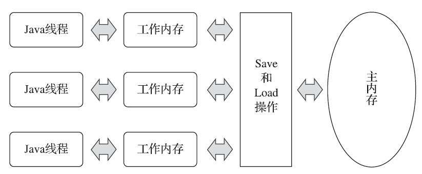

## 1. jvm内存模型(JMM)
Java内存模型的主要目的是定义程序中各种变量的访问规则，即关注在虚拟机中把变量值存储到内存和从内存中取出变量值这样的底层细节。此处的变量（Variables）与Java编程中所说的变量有所区别，它包括了实例字段、静态字段和构成数组对象的元素，但是不包括局部变量与方法参数，因为后者是线程私有的，不会被共享。  

Java内存模型规定了所有的变量都存储在主内存（Main Memory）中，每条线程还有自己的工作内存（Working Memory，可与前面讲的处理器高速缓存类比），线程的工作内存中保存了被该线程使用的变量的主内存副本，线程对变量的所有操作（读取、赋值等）都必须在工作内存中进行，而不能直接读写主内存中的数据。不同的线程之间也无法直接访问对方工作内存中的变量，线程间变量值的传递均需要通过主内存来完成。volatile同样有线程的拷贝内存，但因其操作顺序的特殊，所以看起来和操作主内存一样；  

## 2. 为什么要有jvm内存模型？
参考自 [Java内存模型是什么](https://zhuanlan.zhihu.com/p/91621286)  
为了保证共享内存的正确性（可见性、有序性、原子性），内存模型定义了共享内存系统中多线程程序读写操作行为的规范。
通过这些规则来规范对内存的读写操作，从而保证指令执行的正确性。它与处理器有关、与缓存有关、与并发有关、与编译器也有关。

## 3. 什么是线程间的原子性、可见性、有序性？
原子性（Atomicity）  
基本数据类型的访问、读写都是具备原子性的（例外就是long和double的非原子性协定，读者只要知道这件事情就可以了，无须太过在意这些几乎不会发生的例外情况）。
synchronized块之间的操作保证了原子性

可见性（Visibility）  
可见性就是指当一个线程修改了共享变量的值时，其他线程能够立即得知这个修改。volatile、synchronized、final都可以实现可见性；

有序性（Ordering）  
Java语言提供了volatile和synchronized两个关键字来保证线程之间操作的有序性，volatile关键字本身就包含了禁止指令重排序的语义，而synchronized则是由“一个变量在同一个时刻只允许一条线程对其进行lock操作”这条规则获得的，这个规则决定了持有同一个锁的两个同步块只能串行地进入。

## 4. 针对long和double型变量的特殊规则
Java内存模型要求lock、unlock、read、load、assign、use、store、write这八种操作都具有原子性，但是对于64位的数据类型（long和double），在模型中特别定义了一条宽松的规定：允许虚拟机将没有被volatile修饰的64位数据的读写操作划分为两次32位的操作来进行，即允许虚拟机实现自行选择是否要保证64位数据类型的load、store、read和write这四个操作的原子性，这就是所谓的“long和double的非原子性协定”（Non-Atomic Treatment of double and longVariables）。

如果有多个线程共享一个并未声明为volatile的long或double类型的变量，并且同时对它们进行读取和修改操作，那么某些线程可能会读取到一个既不是原值，也不是其他线程修改值的代表了“半个变量”的数值。
不过主流64位虚拟机不会出现这个问题。